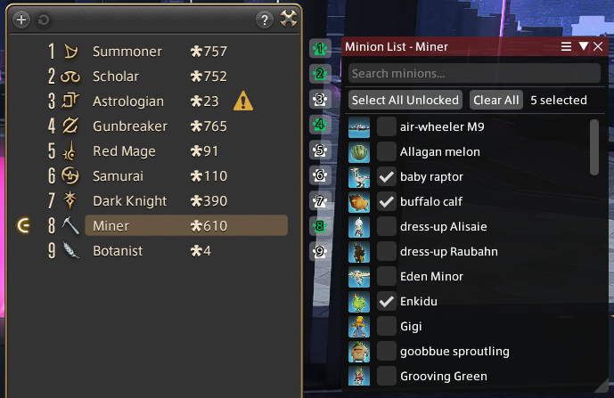

## LoyalCompanion
Associates minion lists with gearsets and auto-summons a random minion from the list when conditions allow.

**Author:** Le Vagabond

## Features
- Configure a list of minions for each gearset
- Automatically summons a random minion from the list when you equip a gearset
- Overlay buttons on the Gear Set List window for quick configuration
- Searchable minion picker with icons
- Respects game state: won't summon while mounted, in combat, in duties, etc.

## Installation
- Download the DLL and manifest JSON from [Releases](https://github.com/Le-Vagabond-gh/ffxiv_loyalcompanion/releases) in the same location
- Open the Dalamud Plugin Installer
- Go to Settings
- Head to the "Experimental" tab
- Under "Dev Plugin Locations", click "Select dev plugin DLL"
- Add the DLL you downloaded
- Press "Save and Close"
- in the main plugin installer window, enable the plugin in Dev Tools

note: adding custom repositories to Dalamud is a security risk, this way protects you from malicious updates from untrusted sources

## Usage
1. Open the Gear Set List in-game
2. Click the paw icon next to any gearset to configure its minion list
3. Check the minions you want associated with that gearset
4. When you equip the gearset, a random minion from the list will be summoned automatically
